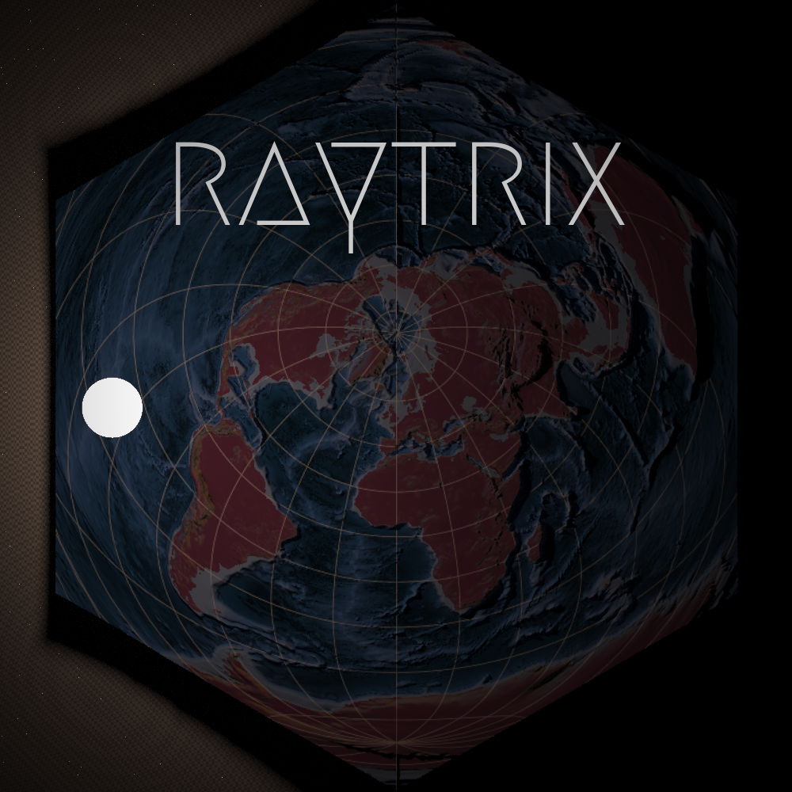

------------
```{r setup, include = FALSE}
library(knitr)
library(rgl)
knit_hooks$set(rgl = hook_rgl)
knitr::opts_chunk$set(
  fig.path = "man/figures/",
  cache = TRUE
)
set.seed(1001)
```
<!-- badges: start -->
[](https://codecov.io/gh/h-a-graham/raytrix?branch=main)
<!-- badges: end -->

raytrix
=========================================================
A {rayshader} plugin providing a spatial framework and convenience functions for 
accessing spatial data. This is similar to and may replace [{ravista}](https://github.com/h-a-graham/rayvista). 
But things are still very much under development.


[](https://github.com/h-a-graham/raytrix/blob/main/inst/hex/raytrix_hex.R)


### Quick Introduction

**Install**
```
devtools::install_github('h-a-graham/raytrix')
```

**Project Canvas:**
with {raytrix} we must first set out a strict geospatial region which define the 
bounds of the area to be mapped; This is referred to as the canvas. This can be 
achieved by direct input or with a spatial oject (currently sf and RasterLayer, 
RasterBrick). global values are set of extent and projections which can be 
viewed with get_canvas(). An Extent object can be produced and be used with 
{rayshader} functions such as `generate_overlay`.

```
set_canvas(xmin, ymin, xmax, ymax, crs)  # basic argument for setting canvas - Done
set_canvas_raster(raster/terra/stars)  # set canvas from a raster data class - Not Done
set_canvas_sf(sf/sfc, mask = FALSE)  # set canvas from an sf/sfc object - Done
set_canvas_centroid(long, lat, radius, crs=4326)  # set canvas from cetroid and radius - Done (although will probably change)
get_canvas()  # retrieves the extent and crs parameters if required for additional steps... - Done
canvasExtent() # get an object of class Extent for using in other {rayshader} functions - Done
```

**Data:**
Now you can use {raytrix} to warp raster data from online or on-disk sources using
the awesome [{vapour}](https://hypertidy.github.io/vapour/) package.
These functions enable the retrieval of topographic (or other single band raster) 
and overlay (3-band raster data) data in a "rayshader-ready" format. 
i.e. matrix for the `topo_matrix` and 4 dimensional 
array for the `map_drape` (4th dim being alpha).

```
topo_matrix(res, src='aws', ...)  
map_drape(res, src='esri.aerial', alpha=1 ...) # many options now available here - need to check in on API Key requirements.
```

**Helplers:**
Some additional helpers for easing interoperability with other spatial and 
plotting libraries (More to come here:

```
texture_to_brick() #  converts a rayshader texture to a raster with the correct extent and crs.
```

**Examples**

Simple map drape over a DEM.

```{r MtStHelens, message=FALSE, warning=FALSE, results='hide'}
library(raytrix)
library(rayshader)

# ---- Mt St Helens ------------
.lat <- 46.200732
.long <- -122.187082
set_canvas_centroid(.lat, .long, radius = 7000)
get_canvas()$extent

tc <- topo_matrix(20)
ov <- map_drape(5)

plot_3d(ov, tc, zscale=25*0.75,  windowsize = 1000,
        theta=150, phi=45, zoom=0.7, fov=50)
render_snapshot()

rgl::rgl.close()

```

Add some shading to the scene with {rayshader}

```{r MtStHelensShade, message=FALSE, warning=FALSE, results='hide'}
# build in rayshader shading tools
texture <- ov%>%
  add_shadow(ray_shade(tc, zscale=20*0.75, sunangle=700, sunaltitude= 30,
                       multicore = T), 0) %>%
  add_shadow(texture_shade(tc, detail=0.6, contrast = 5, brightness = 10),0)

plot_3d(texture, tc, zscale=25*0.75,  windowsize = 1000,
        theta=150, phi=45, zoom=0.7, fov=50)

render_snapshot()

rgl::rgl.close()
```

